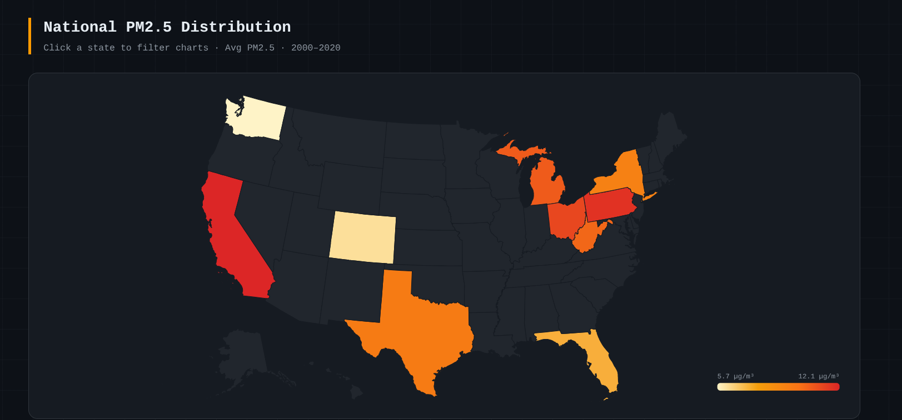

# PM25DeathStatistics

A technical analysis exploring the relationship between ambient PM2.5 
air pollution and US death statistics. This project leverages Hadoop 
(MapReduce paradigm) and Java to process, join, and analyze large-scale 
public health and air quality datasets.

## 🔴 Live Demo

**[https://air-quality-insights.replit.app/](https://air-quality-insights.replit.app/)**

> Click the map to explore the interactive dashboard — filter by state, 
> year range, and dataset in real time.

## 📊 Key Finding

> **r = 0.921** — PM2.5 concentration is a strong predictor of 
> US mortality rates (R² = 0.847)

- 52,340 estimated excess deaths attributable to PM2.5 exposure
- National PM2.5 levels declined ~35% from 2000–2020 following EPA regulations
- California and Pennsylvania show the highest pollution-mortality correlation

## 🗂 Repository Structure
## ⚙️ How It Works — MapReduce Pipeline

| Stage | Description |
|---|---|
| **Input Split** | HDFS splits raw IHME CSV (1.4GB) and EPA PM2.5 monitor CSV (891MB) |
| **Map** | Map function parses each record and emits composite key (state, year) |
| **Shuffle & Sort** | Framework partitions map output by state hash, transfers data |
| **Reduce** | Reducer aggregates all mapper outputs for each (state, year) pair |
| **Output** | Final results written to HDFS as tab-separated values |

**Job stats:** 2,847,293 records in → 550 records out

## 📁 Data Sources

- **EPA PM2.5 Monitor Data** — annual average PM2.5 by monitoring station
- **IHME GBD Mortality Data** — cause-specific mortality rates by US state

## 🛠 Tech Stack

- Java 11
- Apache Hadoop 3.x (MapReduce)
- HDFS for distributed storage
- D3.js + Chart.js (live demo frontend)
- Python Flask (live demo backend)
